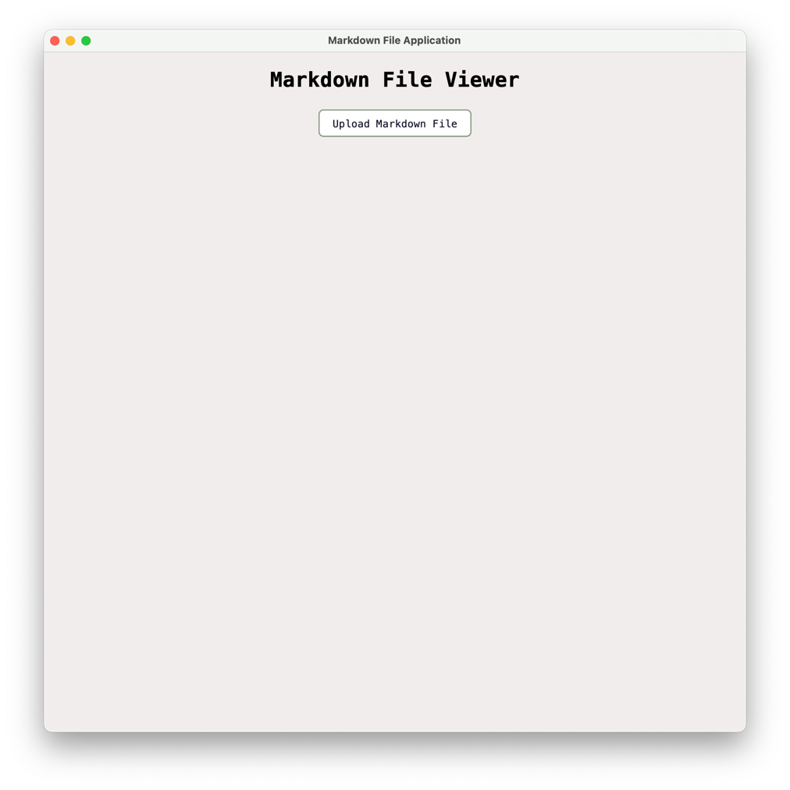
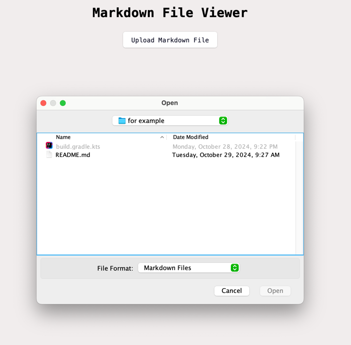
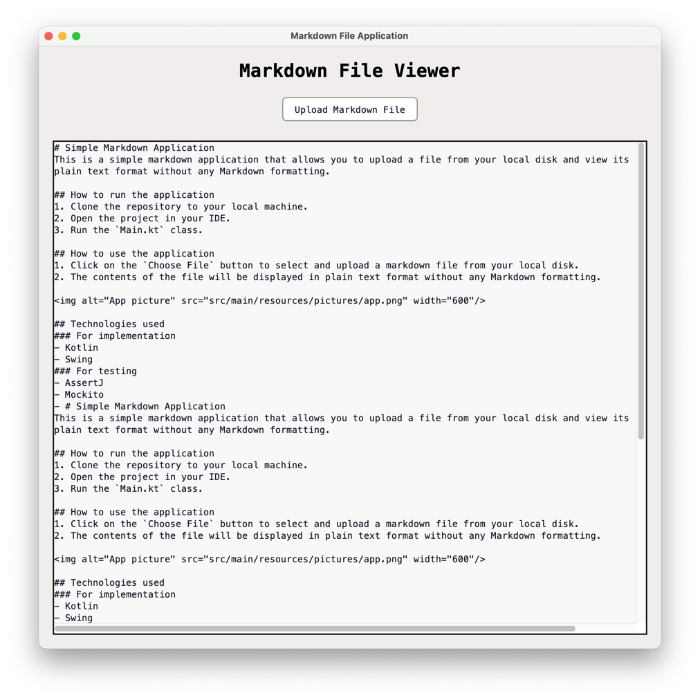
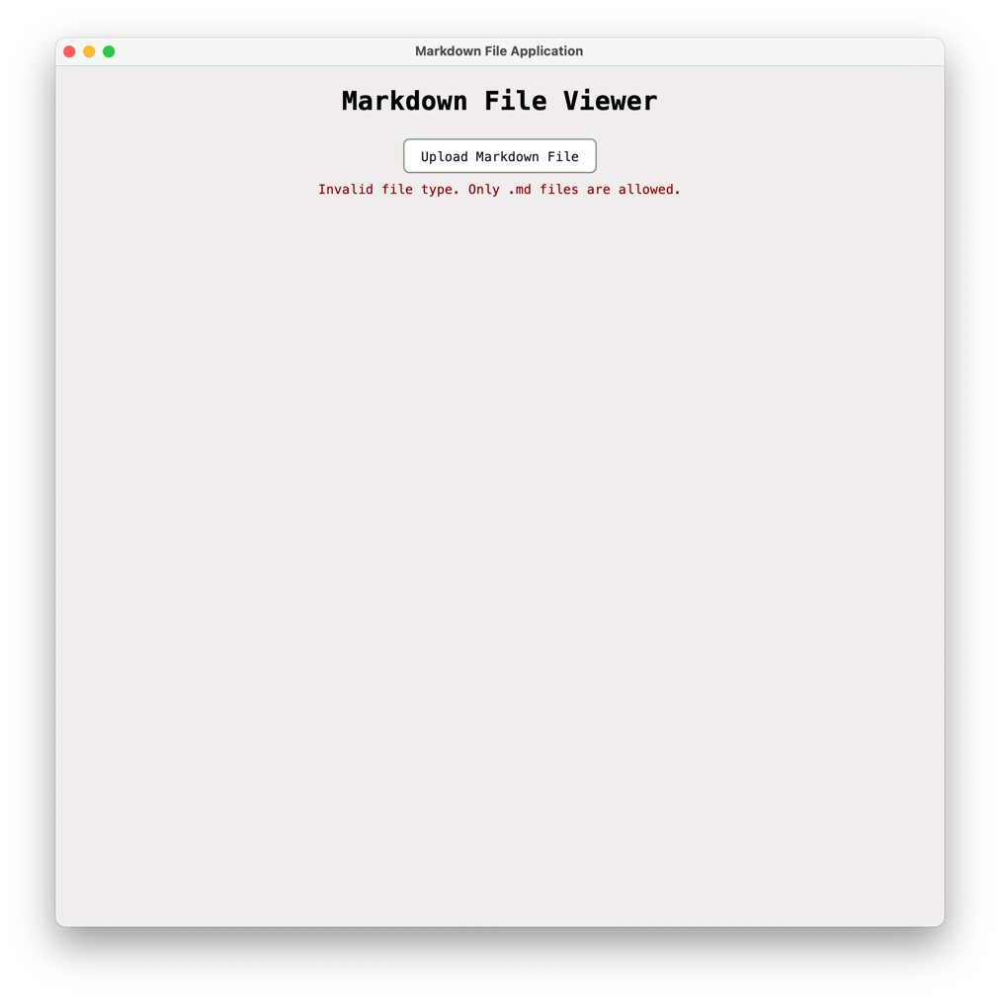

# Simple Markdown Application
This is a simple markdown application that allows you to upload a file from your local disk and view its contents in 
plain text format without any Markdown formatting.

## How to run the application
1. Clone the repository to your local machine.
2. Open the project in your IDE.
3. Run the `Main.kt` class.

## How to use the application

1. Click on the `Upload Markdown File` button to select and upload a markdown file from your local disk.

   

2. The contents of the file will be displayed in plain text format without any Markdown formatting.

If there was an error with the file, such that it is not a markdown file, an error message will be displayed.

## Technologies used
### For implementation
- Kotlin
- Swing
### For testing
- JUnit
- AssertJ
- Mockito